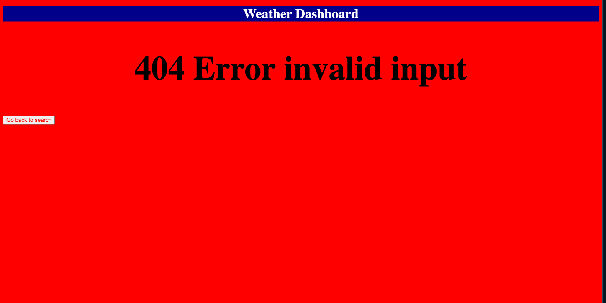

# Weather-Dashboard

Weather Dashboard

## Description

This project is to showcase from stratch how to replicate a weather search wesbite using html, css, javascript / jquery, fetch api, and bootstrap.

## Usage

For this task, I started by making the html page first and an error page to where the user will see a title of weather dashboard and a search option for them. I have not added the api to fetch yet, but the goal is once the user clicks on a city, it will generate the boxes to fetch the information. Added the fetch api. When a user inputs a non city name or incorrect spelling, it will redirect you to the error message.

Source / Credits :

https://openweathermap.org/forecast5

Website URL!!
https://salzm.github.io/Weather-Dashboard/
